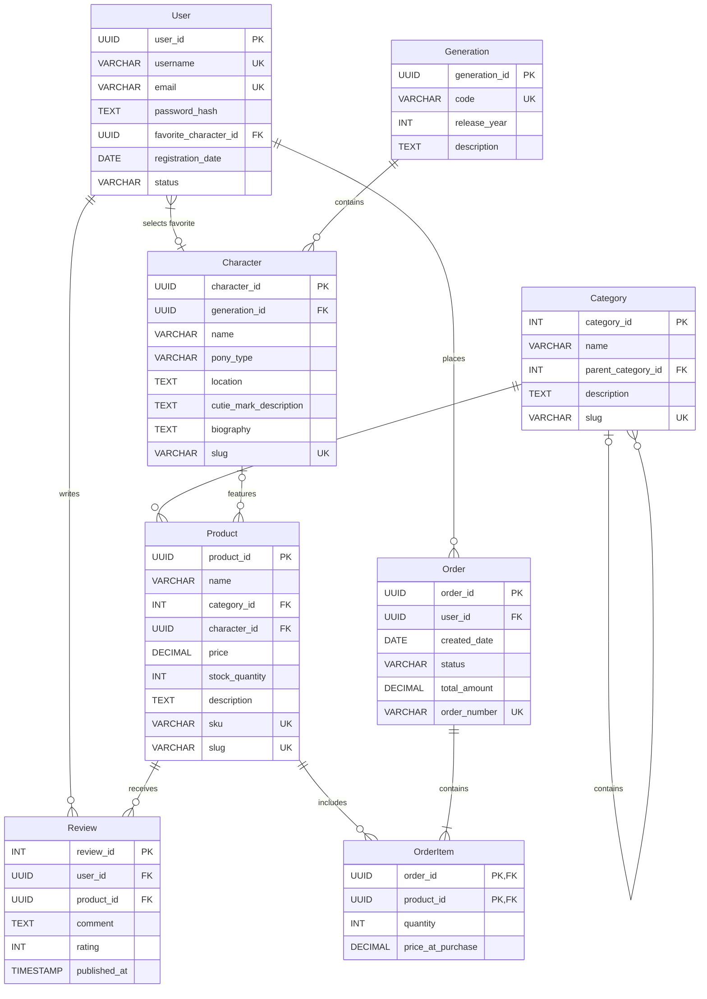

```mermaid
erDiagram
	User {
		UUID user_id PK
		VARCHAR username UK
		VARCHAR email UK
		TEXT password_hash
		UUID favorite_character_id FK
		DATE registration_date
		VARCHAR status
	}

	Character {
		UUID character_id PK
		UUID generation_id FK
		VARCHAR name
		VARCHAR pony_type
		TEXT location
		TEXT cutie_mark_description
		TEXT biography
		VARCHAR slug UK
	}

	Generation {
		UUID generation_id PK
		VARCHAR code UK
		INT release_year
		TEXT description
	}

	Category {
		INT category_id PK
		VARCHAR name
		INT parent_category_id FK
		TEXT description
		VARCHAR slug UK
	}

	Product {
		UUID product_id PK
		VARCHAR name
		INT category_id FK
		UUID character_id FK
		DECIMAL price
		INT stock_quantity
		TEXT description
		VARCHAR sku UK
		VARCHAR slug UK
	}

	Order {
		UUID order_id PK
		UUID user_id FK
		DATE created_date
		VARCHAR status
		DECIMAL total_amount
		VARCHAR order_number UK
	}

	OrderItem {
		UUID order_id PK, FK
		UUID product_id PK, FK
		INT quantity
		DECIMAL price_at_purchase
	}

	Review {
		INT review_id PK
		UUID user_id FK
		UUID product_id FK
		TEXT comment
		INT rating
		TIMESTAMP published_at
	}
	
  User }|--o| Character : "selects favorite"
	User ||--o{ Order : places
	User ||--o{ Review : writes

	Generation ||--o{ Character : contains
	Category o|--o{ Category : contains
	Category ||--o{ Product : contains
	Character o|--o{ Product : features

	Product ||--o{ Review : receives
	Product ||--o{ OrderItem : includes
	Order ||--|{ OrderItem : contains
```
