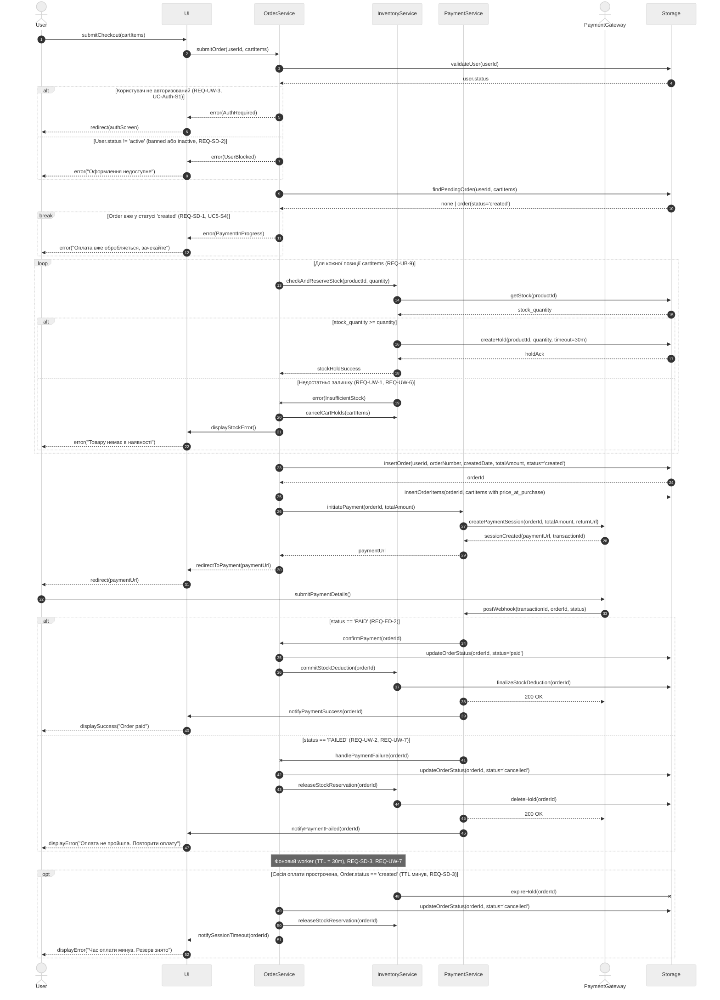

## Sequence діаграма

```mermaid
%%{init: {'theme': 'neutral', 'themeVariables': { 'background': '#ffffff' }}}%%
sequenceDiagram
	autonumber
	actor User
	participant UI
	participant OrderService
	participant InventoryService
	participant PaymentService
	actor PG as PaymentGateway
	participant Storage

	User->>UI: submitCheckout(cartItems)
	UI->>OrderService: submitOrder(userId, cartItems)

	OrderService->>Storage: validateUser(userId)
	Storage-->>OrderService: user.status

	alt Користувач не авторизований (REQ-UW-3, UC-Auth-S1)
		OrderService-->>UI: error(AuthRequired)
		UI-->>User: redirect(authScreen)
	else User.status != 'active' (banned або inactive, REQ-SD-2)
		OrderService-->>UI: error(UserBlocked)
		UI-->>User: error("Оформлення недоступне")
	end

	OrderService->>Storage: findPendingOrder(userId, cartItems)
	Storage-->>OrderService: none | order(status='created')

	break Order вже у статусі 'created' (REQ-SD-1, UC5-S4)
		OrderService-->>UI: error(PaymentInProgress)
		UI-->>User: error("Оплата вже обробляється, зачекайте")
	end

	loop Для кожної позиції cartItems (REQ-UB-9)
		OrderService->>InventoryService: checkAndReserveStock(productId, quantity)
		InventoryService->>Storage: getStock(productId)
		Storage-->>InventoryService: stock_quantity
		alt stock_quantity >= quantity
			InventoryService->>Storage: createHold(productId, quantity, timeout=30m)
			Storage-->>InventoryService: holdAck
			InventoryService-->>OrderService: stockHoldSuccess
		else Недостатньо залишку (REQ-UW-1, REQ-UW-6)
			InventoryService-xOrderService: error(InsufficientStock)
			OrderService->>InventoryService: cancelCartHolds(cartItems)
			OrderService->>UI: displayStockError()
			UI-->>User: error("Товару немає в наявності")
		end
	end

	OrderService->>Storage: insertOrder(userId, orderNumber, createdDate, totalAmount, status='created')
	Storage-->>OrderService: orderId
	OrderService->>Storage: insertOrderItems(orderId, cartItems with price_at_purchase)

	OrderService->>PaymentService: initiatePayment(orderId, totalAmount)
	PaymentService->>PG: createPaymentSession(orderId, totalAmount, returnUrl)
	PG-->>PaymentService: sessionCreated(paymentUrl, transactionId)
	PaymentService-->>OrderService: paymentUrl

	OrderService-->>UI: redirectToPayment(paymentUrl)
	UI-->>User: redirect(paymentUrl)

	User->>PG: submitPaymentDetails()
	PG->>PaymentService: postWebhook(transactionId, orderId, status)

	alt status == 'PAID' (REQ-ED-2)
		PaymentService->>OrderService: confirmPayment(orderId)
		OrderService->>Storage: updateOrderStatus(orderId, status='paid')
		OrderService->>InventoryService: commitStockDeduction(orderId)
		InventoryService->>Storage: finalizeStockDeduction(orderId)
		PaymentService-->>PG: 200 OK
		PaymentService->>UI: notifyPaymentSuccess(orderId)
		UI-->>User: displaySuccess("Order paid")
	else status == 'FAILED' (REQ-UW-2, REQ-UW-7)
		PaymentService-xOrderService: handlePaymentFailure(orderId)
		OrderService->>Storage: updateOrderStatus(orderId, status='cancelled')
		OrderService->>InventoryService: releaseStockReservation(orderId)
		InventoryService->>Storage: deleteHold(orderId)
		PaymentService-->>PG: 200 OK
		PaymentService->>UI: notifyPaymentFailed(orderId)
		UI-->>User: displayError("Оплата не пройшла. Повторити оплату")
	end

	Note over OrderService,InventoryService: Фоновий worker (TTL = 30m), REQ-SD-3, REQ-UW-7
	opt Сесія оплати прострочена, Order.status == 'created' (TTL минув, REQ-SD-3)
		InventoryService-xStorage: expireHold(orderId)
		OrderService->>Storage: updateOrderStatus(orderId, status='cancelled')
		OrderService->>InventoryService: releaseStockReservation(orderId)
		OrderService->>UI: notifySessionTimeout(orderId)
		UI-->>User: displayError("Час оплати минув. Резерв знято")
	end
```
